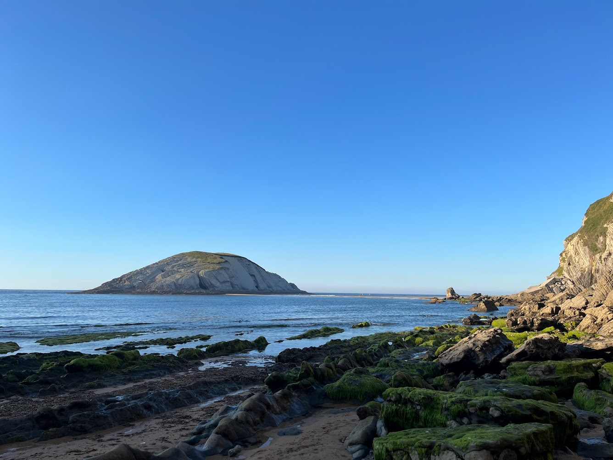
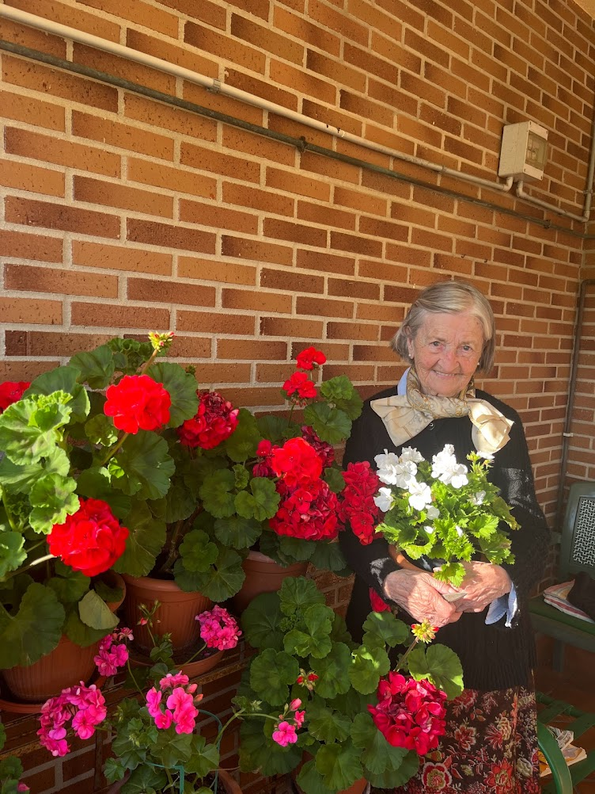

Hoy once de julio es el cumpleaños de mi abuela. 
Cumple 98 o 99 años. 
En su DNI aparece que nació en 1924 pero ella insiste en que es un error, que nació en 1923.

La semana pasada fuimos todas a Pamplona. Yo me despedí de la que ha sido mi casa (literal y figurativamente) estos últimos dos años. Después hicimos lo que para mi hermana y para mí era un clásico julio pre-covid: San Fermín y BBK Live. Ha sido especial por muchas cosas, pero también porque quizá sea último de este tipo de julios.

Ayer volvimos a casa. 
Tras 3 días de festival, no es prudente acercarse a una mujer cuasi-centenaria. 
Sinceramente no es algo que pensase en abril cuando compramos las entradas y hoy cuando hemos tenido que ir a felicitarla en el porche, con mascarilla y distancia me he maldecido bastante. 
Y sin embargo, debo estar agradecida de que podamos estar.

Después hemos mi hermana y yo a la mejor playa de Cantabria a darnos el baño en la hora dorada. Estábamos solas y nos hemos bañado desnudas en aquella bañera gigante y, aunque confieso que en el momento no lo pensé, de cierta manera es poético: como hace veinticinco años cuando entrábamos las dos en la antigua bañera de nuestra casa. 

_Feliz cumpleaños a la mejor persona que conozco en la faz de la tierra. Qué dicha disfrutarte._
