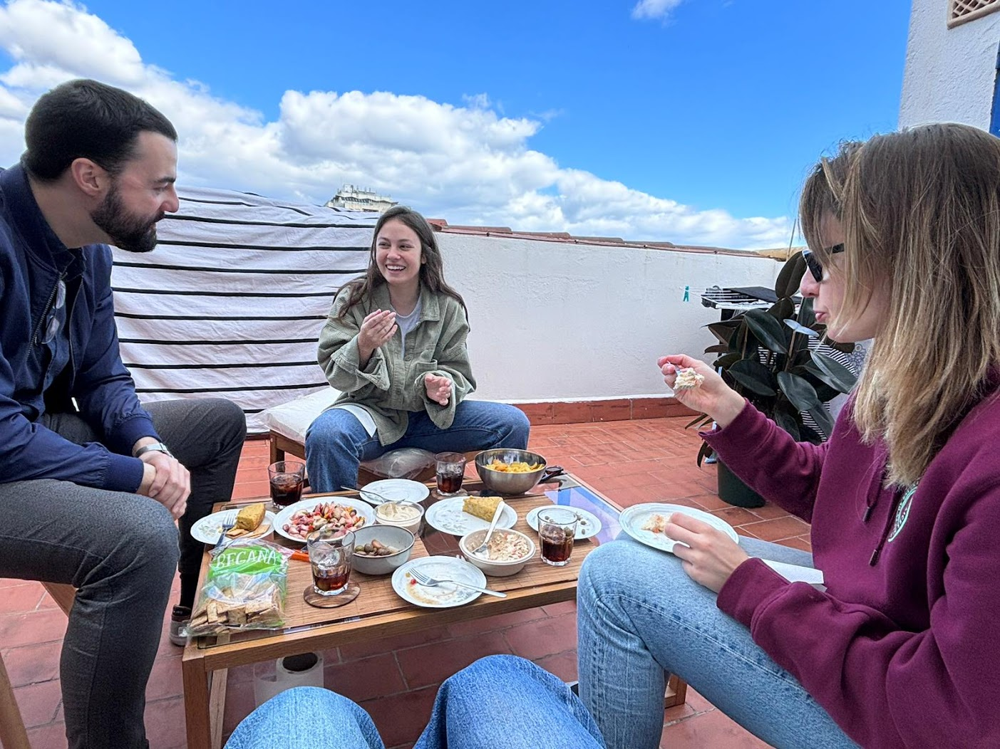

- Estoy leyendo [Knowledge, Reality and Value](https://www.goodreads.com/book/show/57610167-knowledge-reality-and-value) de Huemer. El capítulo sobre la teoría de la personalidad (¿qué es lo que nos hace ser nosotros?) me ha gustado ‒por dar contexto, desarrolla [esto](https://waitbutwhy.com/2014/12/what-makes-you-you.html)‒ y concluye que la teoría más plausible es que exista el alma. No estoy segura de si es posible que haya otra conclusión: que no exista la identidad, que nos contemos esa historia a nosotros mismos pero que no sea real.
- Dwarkesh ha sacado un podcast con [Tyler Cowen](https://youtu.be/EY2nbAVZB-k) y [Patrick Collison](https://youtu.be/WU-lBOAS1VQ). Tanta densidad de información que me voy escuchando cachitos de vez en cuando.
- Encontrar a gente de [poca experiencia, y mucho potencial](https://worktopia.substack.com/i/141089382/a-guide-to-finding-diamonds-in-the-rough). [Relacionado](https://twitter.com/javisantana/status/1757013141903294781).
- [Cómo fallan los sistemas complejos](https://how.complexsystems.fail/)
- [Tener agencia](https://usefulfictions.substack.com/p/how-to-be-more-agentic) y _sentir_ que tienes agencia están estrechamente relacionados.
- Sobre [Pablo Neruda](https://www.newyorker.com/news/daily-comment/the-second-death-of-pablo-neruda) y cómo se entiende su figura en Chile.
- [Estrategia de comunicación en Anduril](https://www.piratewires.com/p/anduril-comms-strategy-early-days)
- [Magenta](https://www.youtube.com/watch?v=H09Wrym-5C0) en vivo. Parece que van a sacar [nuevo](https://youtu.be/Pmo4zOVVDrs) [disco](https://youtu.be/VbaBxZ4zoiM).
- Me encantó [Chinas](https://youtu.be/VhZBGuh7uu4).
- He escrito sobre [El Local](https://rbarbadillo.github.io/el-local), para que no se me olvide.

Barcelona nos trata bien.

