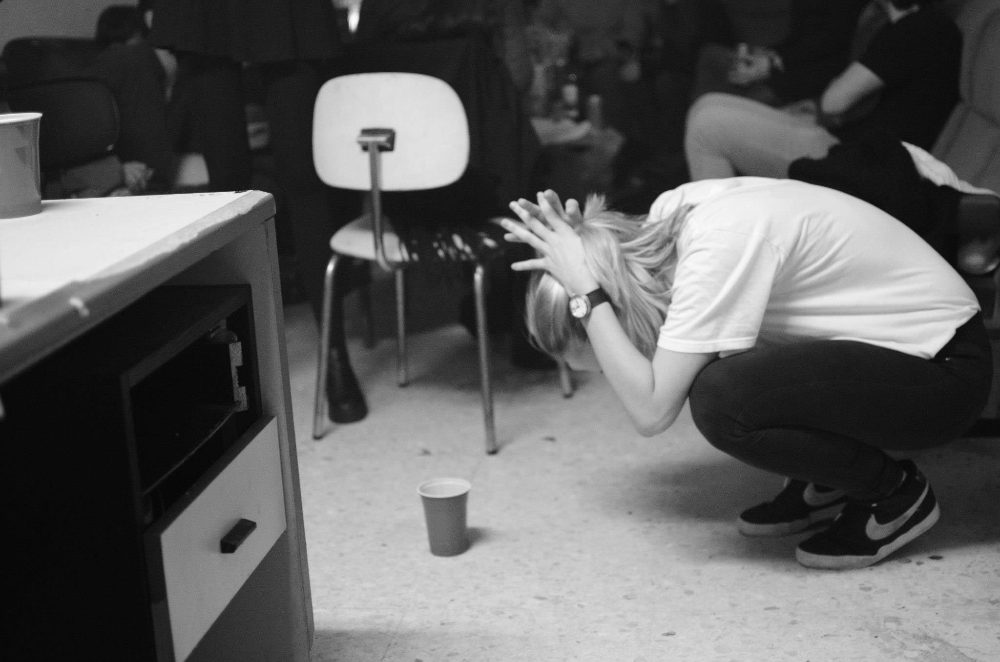

Cuando me planteo si debiera haber estudiado otra cosa al final siempre digo que no. Estudié ingeniería química y, de momento, he terminado programando. Académicamente, me hubiera gustado más hacer matemáticas y filosofía. Pero hacer ingeniería química en Cantabria me hizo vivir cosas que no cambiaría.

Desde que tuve 3 años hasta terminar el instituto, fui siempre al colegio e instituto de mi pueblo con la misma gente (algo que tampoco cambiaría). Ahí pasa lo que pasa también con tu familia a lo largo de los años: te conocen de pequeño y se establecen unas dinámicas específicas cuando eres muy joven. A veces te quedas como atascado en tu personalidad de cuando tienes 10 años.

La universidad, con gente nueva, me dio la oportunidad de presentarme sin todo ese contexto adquirido, y fue un gran cambio. De repente salía de jueves a domingo. Fui la típica delegada de risas (luego descubrieron que me lo tomaba en serio). En general, aprendí a socializar.

Primero salíamos todos los de la carrera juntos. Luego, fuimos ampliando y cambiando el círculo y en tercero de carrera llego El Local. Nació en la rotonda de Río de la Pila, y entonces ya se convirtió en una cosa de lunes a domingo. El ambiente, la gente, [la música](https://open.spotify.com/playlist/6GVArwtJPvuO9Zl0ug07Eg?si=57ad59742b0847c2), [los micros abiertos](https://youtu.be/pybu6ekAWUE?feature=shared). Estábamos todos como hechizados con ir a ese sitio ‒con un alcohol terrible, tabaco en el ambiente‒ y ponernos a hablar.

En aquellos entonces, Miley Cyrus estaba [creciendo y rebelándose con nosotros](https://youtu.be/LrUvu1mlWco). Escuchando su último disco encontré a [esta canción](https://open.spotify.com/track/41WQUSINanQHfhfKpFDsms?si=5630ed0fa22448a1):

> I know I used to be crazy  
Messed up, but, God, was it fun  
I know I used to be wild 
That's 'cause I used to be young 

> Those wasted nights are not wasted 
I remember every one 
I know I used to be crazy 
That's 'cause I used to be young 

>You tell me time has done changed me 
That's fine, I've had a good run 
I know I used to be crazy 
That's 'cause I used to be young

Pensé en esos años. La canción es demasiado dramática porque la verdad es que tampoco era aquello tan salvaje, pero fue intenso emocionalmente. Y estoy extremadamente agradecida por haberlo vivido.

La gran mayoría de fotos no las puedo compartir (no me gustaría ver una foto yo con 20 años tirada en un sofá a las 5 am en un blog que alguien comparte sin consultarme), pero aquí va una de las pocas que creo que son aceptables:

