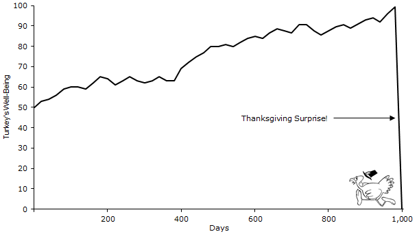

Este mes sigue sin haber cachitos. Esta es una recopilación de cosas que cambiaron mi forma de ver el mundo. Espero continuar esto en 2030, 2040, etc. y poder  ver alguna evolución.

- [The Use of Knowledge in Society](https://www.cato.org/sites/cato.org/files/articles/hayek-use-knowledge-society.pdf), de Hayek.
- ["We exist inside the story that the brain tells itself"](https://youtu.be/tyrPMVMb-Uw?si=Z_PmokNnp7n2Z-NH) que me llevó, en general, al [problema de la identidad](https://waitbutwhy.com/2014/12/what-makes-you-you.html).
- [El progreso es posible e importante](https://www.goodreads.com/book/show/34890015-factfulness). [Los riesgos existenciales también](https://www.goodreads.com/book/show/242472.The_Black_Swan). 
  
- A mayores, [el progreso es un imperativo moral y deberíamos tener más en cuenta el largo plazo](https://press.stripe.com/stubborn-attachments).
- [La superioridad moral de un sistema que permite elegir](october-23-2021).
- [Vivimos en una gerontocracia](https://www.goodreads.com/book/show/125378528-la-juventud-atracada).
- [_Vean, pues, los ingenieros cómo para ser ingeniero no basta con ser ingeniero._](https://monoskop.org/images/d/d4/Ortega_y_Gasset_Jose_1939_1964_Meditacion_de_la_tecnica.pdf)