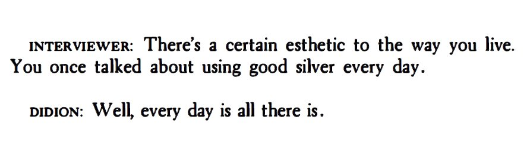

- Este [álbum](https://open.spotify.com/intl-es/album/4tBXKI7G2sQ67Y5VAsxkzv?si=juTHqyJQQLSJYe6LrtvcIQ) y este [tema](https://open.spotify.com/intl-es/track/7tJ2ZPwHRrPTy1OW7jais0?si=3857377c84664087).
- Alberto está escribiendo bastante. Me encantó esto sobre [el feedback](https://albertoromero.com/feedback). Va a sacar [Lontano](https://buttondown.com/albertoromero/archive/i-met-my-october-okrs/) una app de intercambio de casas solo por invitación para amigos (y amigos de amigos).
- [2 days to go](https://www.kaggle.com/competitions/arc-prize-2024/leaderboard)!
- [FrontierMath](https://epochai.org/frontiermath)!
- [Dario sobre qué puede salir bien](https://darioamodei.com/machines-of-loving-grace#5-work-and-meaning). Se lo pasé a mi padre y sorprendentemente le gustó. Caí en el rabbit-hole y leí [Down and Out in the Magic Kingdom](https://www.goodreads.com/book/show/29587.Down_and_Out_in_the_Magic_Kingdom).
- [JFV y Alice Evans](https://youtu.be/EM8200Vl7R4)
- [¿Ozempic](https://x.com/jburnmurdoch/status/1842163184838250764)? [Esto](https://www.astralcodexten.com/p/why-does-ozempic-cure-all-diseases).

