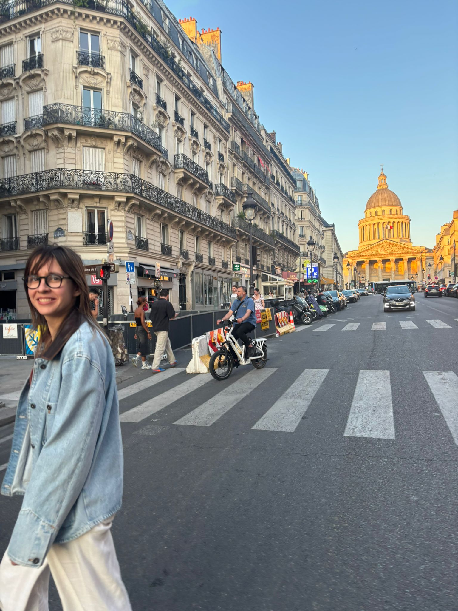

- I think living in Barcelona has spoiled me. I found Paris super beautiful but sometimes I was like… “and so?”
- I found Paris cleaner than most big cities in Spain (Madrid and Barcelona)
- La Seine at sundown is the best plan. Classy *botellón*!
- No AC. I find it hard to believe that you subject people to 40 min on a 30ºC train. (Spain is sometimes like this too, it just doesn't cease to surprise me)
- French people are very nice if you try to speak French. Even if it is very broken French. Caveat: I always smile a lot so I usually already have “nice person” vibes.
- Very few cars in the city. Nice to walk around.
- Sometimes the streets felt empty. Perhaps it was the heat, or that we visited during the Bastille weekend, but there was the feeling that lots of big streets had “nothing”. Everything was closed, there were no people hanging around.
- Living in a small town lets you be a lot more conservative. I think of Santander and it's such a homogeneous town. There are very few people who are beyond the standard deviation in looks and thoughts. Life experience varies a lot more from small to big cities than from country to country. (Obvious?)
- Bread is important to me and to them. I love that.
- That European capital city exhaustion hits different. In smaller cities you can "complete" them, see everything.

