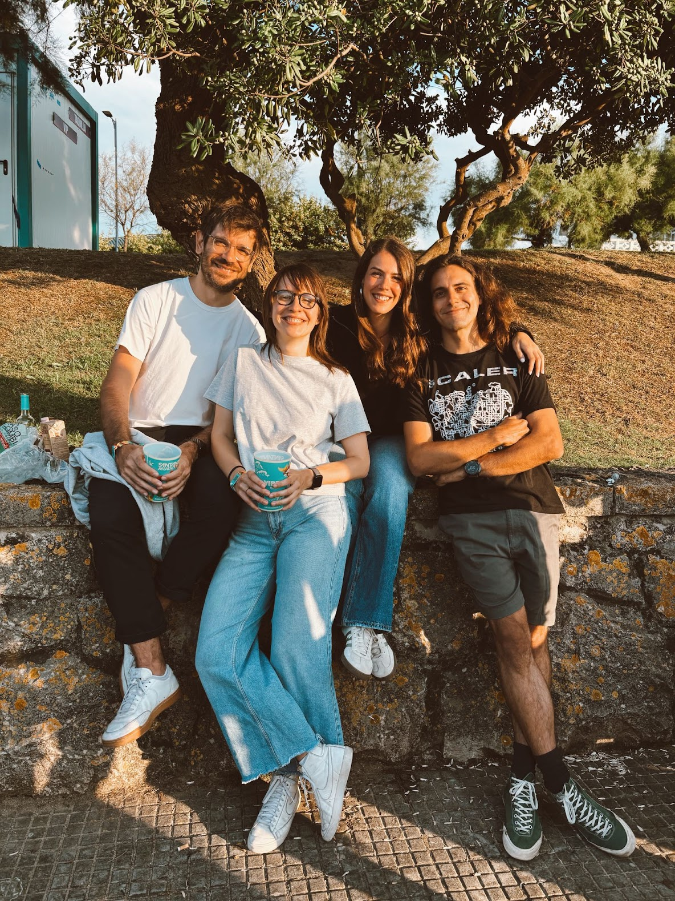
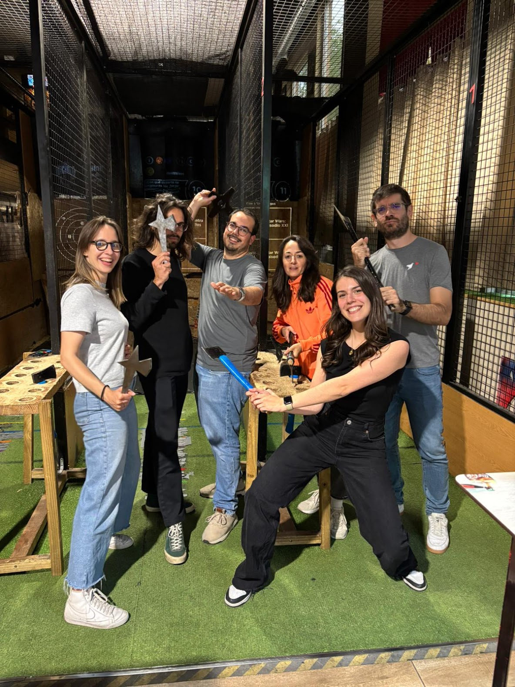
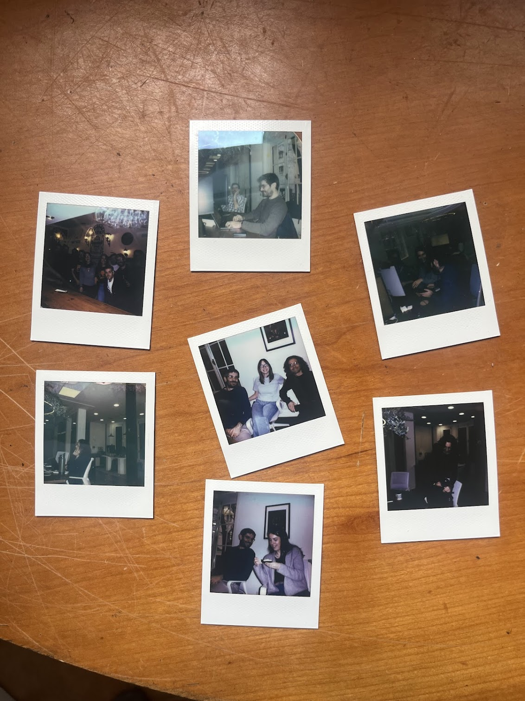
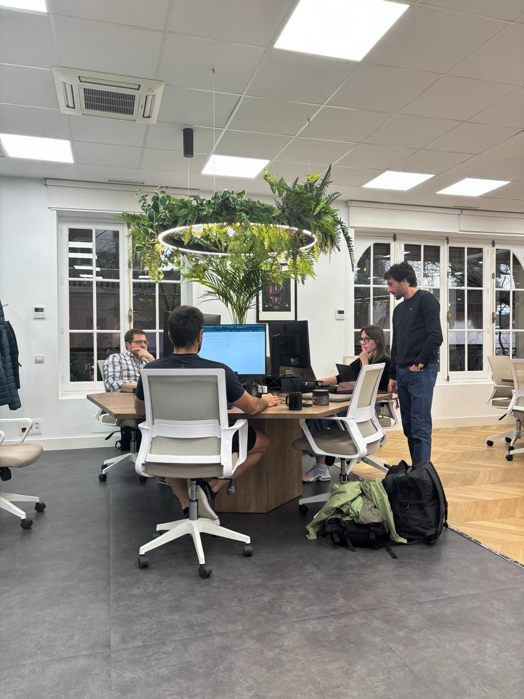

I worked at Tinybird for 3 years. In all honesty, it still hasn't fully sunk in that I won't be part of it anymore. I feel that I've grown tremendously during my time there, so I wanted to pitch in and share my experience.

Why?

- I've thoroughly enjoyed reading other people's tales of what companies are like from the inside ([Palantir](https://nabeelqu.co/reflections-on-palantir), [OpenAI](https://calv.info/openai-reflections)) and while I realize Tinybird's reach is way smaller, I see a lot of value in telling the story from ex-employees. I wish more of these existed, we could act as historians of our own work and [it wouldn't be so ephemeral.](https://curiosity.ventures/posts/why-a-blog) I also think there's more value in one specific person telling their own story within a company, than content produced by the company itself. It's more authentic.
- Something that's been haunting me lately is that I've given it my all for years, and now I don't have anything to show for it. Vested options exist for this reason! But in any case, this is my way of documenting my journey through Tinybird. I'd like to have something to read and remember ten years down the line.
- Before joining Tinybird, I'd never experienced the "startup way of life". I'd love if this text served as a window for people who are "outside" to peek into it and perhaps encourage them to join one.

Here we go.

## First, what is Tinybird?

[Tinybird](https://www.tinybird.co/) is a managed ClickHouse solution, with **lots** of developer experience goodies. If you already know what ClickHouse is, [you can read this to understand what differentiates Tinybird from ClickHouse Cloud](https://www.tinybird.co/blog-posts/tinybird-vs-clickhouse). If you don't, here's a tl;dr: ClickHouse is an open-source columnar database that's insanely fast for analytics queries. From what I've seen, [it is becoming the default for big companies to handle analytical queries](https://claude.ai/share/9964b493-5ce1-4353-9956-bfa7bd8bc665). While it's incredibly powerful, running it in production is complex: you need to handle replication, schema migrations, query optimization, and the inevitable 3am incidents when your cluster decides to misbehave. The OSS version of ClickHouse is not optimized for cloud storage, so you either fork it and do it yourself, or pay for a managed version. Tinybird abstracts away this operational nightmare while adding a developer-friendly API layer on top, so you get ClickHouse's performance without the suffering. [Javi](https://x.com/javisantana) wrote about it some months ago, in a banger [series](https://www.tinybird.co/blog-posts/what-i-learned-operating-clickhouse) of [posts](https://www.tinybird.co/blog-posts/what-i-learned-operating-clickhouse-part-ii).

During my three years as a backend engineer, Tinybird went through several re-orgs, one layoff, and I rotated across ~4 product teams. Just before I joined, Tinybird had raised a [Series A](https://www.tinybird.co/blog-posts/tinybird-series-a-whats-next) round and last year, we raised a [Series B](https://www.tinybird.co/blog-posts/announcing-tinybird-series-b) round. We've launched dozens of new features, most notably the latest iteration of the product, Forward, that I'll get into in a section below.

A sampling of what I contributed to: early attempts at adding [Projections](https://clickhouse.com/docs/sql-reference/statements/alter/projection) (which failed initially, though [Jordi cracked it years later](https://www.tinybird.co/blog-posts/query-booster-how-tinybird-optimizes-table-schemas-for-you)), creating and then scaling [Copy Pipes](https://www.tinybird.co/docs/forward/work-with-data/optimize/copy-pipes), introduced [Redis Sentinel](https://redis.io/docs/latest/operate/oss_and_stack/management/sentinel/) for high-availability, building [Sink Pipes](https://redis.io/docs/latest/operate/oss_and_stack/management/sentinel/), developing [Organization-level Service Data Sources](https://www.tinybird.co/docs/forward/monitoring/service-datasources#organization-service-data-sources), and various improvements around [Populates](https://www.tinybird.co/docs/classic/work-with-data/process-and-copy/populate-data).

Tinybird is now around 60 people, and the product and engineering team is ~30.

## Why I joined

Before joining, I was working at [Veridas](https://veridas.com/es) as a backend engineer. That was my first full-time job as a software engineer ([I am an industrial engineer by training](https://rbarbadillo.github.io/industrial-engineer)). I watched Javi (a co-founder) and [Elena](https://elenatorro.com/) (first employee and just an awesome person) from afar, like observing the cool kids playing on the other side of the school yard. Twitter/X is a great place to watch startups and their employees, see how they vibe and learn about them. If you're interested, follow them, interact, show interest! And most importantly, [write on the internet.](https://www.benkuhn.net/writing/)

I knew [Javi read my blog](https://x.com/javisantana/status/1411796616856621058) and one day he slid into my DMs, we agreed to talk one Friday afternoon, and did the rest of the interview process with Elena and [alrocar](https://x.com/alrocar). They made an offer, I accepted as quickly as I could. As per [Félix](https://x.com/flopezluis)'s words I was "the most junior hire we've ever done in the product team". I struggled with the most basic SQL and knew nothing about databases.

It was a no-brainer for me because Tinybird offered two things I was looking for: great engineering challenges and a chance to see (and shape) every part of a startup.

There were some bonus points:

- Experienced founders.
- I like engineering, that's one of the reasons it's my job. But I like dabbling in marketing, sales, whatever. I don't like working in silos.
- Technical challenge and "talent density" (sorry for the buzzword).
- Last and least (yes): at the time, I really wanted remote work. (My views on this have shifted somewhat, I'll write about this soon).

This was [my team](https://x.com/alrocar/status/1663647138922864640) the first ~2 years, as you can read from the caption, amazing people. I remember [Aitana](https://x.com/AitanaAzc) telling me how lucky I had been to land in a team with Elena, alrocar and [Iván](https://x.com/hacheka) (initially it was just us). They had amazing knowledge of the product and customers, as well as ownership. Elena and alrocar both jumped to fix and unblock customers, regardless of teams, their current role. I do think this was critical in my understanding of "how we work at Tinybird".

During my first six months, I thought I'd be fired any day. This was all in my head, I received nothing but good feedback but I still struggled mentally. I wasn't mature enough to communicate it in the first place and handle it second. It's very likely that the remote environment made this worse. I sometimes thought that I was asking too many questions and being annoying, and sometimes the opposite, that I wasn't being productive enough because I should've asked something earlier. I had never been at a company that fired people purely for performance reasons, so I needed to adjust to that too. Around the six-month mark, I started feeling way more confident. Joining on-call shifts and seeing that I could handle a fire helped.

## **Culture**

Most of these cultural traits were true when I joined, but they've become... *truer* in a way. Or at least, I see them more clearly now. When you're a newbie, you don't see some obvious things around you.

Over the last year, Tinybird has changed significantly like most other companies: fewer people, more hands-on managers, less bureaucracy. These changes haven't altered the core culture, they've distilled it.

- You are rewarded for action. **Tinybird is for doers.** You will not thrive if you open a ticket and think your work has finished there.
- You are also rewarded for being succinct in your insights and **expressing your thoughts clearly and concisely in writing** (this includes short essays and code snippets). You will not thrive if you enjoy writing 20-page memos. [Santana](https://javisantana.com/landing.html), [Jordi](https://jordivillar.com/blog) and [Del Amo](https://x.com/a_delamo) are very good at this, and it permeates the culture. [Basecamp was](https://x.com/javisantana/status/1952324537447559611) a great tool for this. I think this is why Javi messaged me initially, my way of writing leans toward that style.
- Most leadership people now come from having been Customer Success or very technical people. So, most managers know the product and customers, as well as being able to make PRs to fix stuff. [These transitions are sometimes hard.](https://jordivillar.com/blog/becoming-irrelevant)
- There's **not a lot of hand-holding**. In general, it is a big plus if you can just unblock yourself. And if you know when to bother someone to unblock you.
- As expected, low-level ClickHouse knowledge is a great premium. It's hard to get talent like that, and it's hard to grow into knowing it (you are always in a hurry) but it makes a huge difference.
- We have shared Slack channels with many clients and when not, there's the Community Slack and [Plain](https://www.plain.com/). **It is expected that product engineers engage with clients often.** This is a huge benefit, I loved being able to read customer pains first-hand and jump in and solve them. In my previous experiences, I had less direct exposure to clients, which made it harder to understand product gaps.
- It's a remote company but they [have just started hiring for onsite roles](https://x.com/javisantana/status/1945764727352926500). It's quite a cultural shift, but one that was a long time coming in my opinion.
- **The founders** of Tinybird are Santana, Sergio, Sancha, Raúl and Jamón. As you might have noticed, they are 5. This comes with good things and bad things: [as Dario commented this can be a great thing when wanting to scale](https://youtu.be/GcqQ1ebBqkc?si=Gxx502QEdzr5v_nP&t=117), there's a lot of founder energy! But also, if two founders have conflicting opinions and are interested in the same thing, it's a hard situation to solve. If the company *does not* scale, there's less room for leadership positions, since they are the ones already holding them.
- Besides the founders, some employees have a great impact on culture. I've already mentioned Jordi and Del Amo, but [Rafa](https://x.com/rmorehig), [Nuria](https://x.com/nmediavilla19), alrocar, [Aitana](https://x.com/AitanaAzc) and [Adri](https://x.com/adrymyry) are there too, each in their own personal ways.

## **Code**

- Every **backend engineer and SRE is expected to do on-call**. There's a single rotation for the whole platform and product. This is scary as hell at the beginning but also gives you breadth. I had never done any on-call before so I have no benchmark, but I think it was pretty well managed. There are runbooks for all alerts (of course, the thing about on-call is that unexpected things happen, so often runbooks help you establish some baseline but don't help you solve the alert fully) and a weekly meeting used to track that all unexpected things are being handled so they stop happening.
- The stack: the backend is in Python (the app that receives the requests) and C++ (ClickHouse, some ingestion parts). The CLI is Python too and the UI is built in Next.js. We use OpenResty for load balancing, Redis for storing metadata and Kubernetes for autoscaling and probably some other tools I'm missing.
- ClickHouse is not, but all other things are in a big monorepo. You can find the main app, bash scripts and other stuff to automate ClickHouse upgrades, the front-end, the CLI, etc.
- There are lots of providers and regions to maintain within providers.
- There has been a pipeline from CARTO to Tinybird: the founders all met each other while working there, and CARTO underwent some restructuring in late 2024. So both the network was already established and people became available.
- Because of the "doer" culture, a PR with your implementation of what you want is the best way to get buy-in for anything. You should add Jordi or Del Amo as reviewers to get an easy approval ;)

## Launching Forward

The last 6 months have been particularly special. Santana, Jordi and Rafa had started a team to evolve the product significantly. The project shouldn't take too long to launch either so that we could quickly see where we were wrong.

So, they started Forward: a complete reimagining of the developer experience that lets users run and develop everything **locally** on their machine with instant feedback loops, while also integrating **AI-native features** like generating entire projects with prompts (and now an [agent](https://www.tinybird.co/tinybird-code)!). It automates the painful parts of data infrastructure management so you can just write SQL locally, test instantly, and **deploy to production with a single command.**

They put together a team that started in November, I joined them in January. [Jakub](https://es.linkedin.com/in/xjakub) already had a working version of [Deployments](https://www.tinybird.co/docs/forward/test-and-deploy/deployments) and [Enric](https://x.com/eclbg) was already starting to work on them too, I joined them to iterate on it. We've put out [two](https://www.tinybird.co/blog-posts/tb-deploy) [posts](https://www.tinybird.co/blog-posts/when-not-to-migrate-your-data) about what Deployments are but, in a nutshell: they automatically handle the complex orchestration of updating ClickHouse materialized views and their downstream tables without breaking your real-time ingestion chains, managing all the data migration, backfilling, and schema changes that would otherwise require manual intervention and downtime. It has been intense, and **so much fun**. I love working on something I've seen be a huge pain to our customers, something that prospects and clients are genuinely excited about and something that is novel.

It's also been amazing because of the team. These are a few snaps of us doing things outside of work ([Rafa](https://x.com/rmorehig) secretly hates us all so he's not in any of them).

<small>Left to right: Jordi, me, Nuria and Enric in Santander in early August</small>

<small>Left to right: me, Enric, Gonzalo, Julia, Nuria and Jordi</small>

<small>Some very dark images of us working on the [Forward release](https://www.tinybird.co/blog-posts/announcing-tinybird-forward), last March.</small>

<small>The office space, opened last summer, is really really cool!</small>

<small>Left to right: [Gonzalo](https://x.com/GnzJgo), [Jordi](https://x.com/jrdi), me, [Pastori](https://x.com/vrzgc) and [Bete](https://x.com/miguelbetegon) during the Christmas dinner.</small> 

## Parting thoughts

- I got what I wanted: technical challenges and a seat at the table in how to do a startup.
- I remember Sergio saying that the reason he personally was doing Tinybird was to give people a place where they could thrive and work. That is exactly what I have gotten.
- It was super rewarding to work with friends.
- I was working on what interested me the most (automatic schema and data migrations), with the people that I wanted. I also had direct access to pick Javi's brain, which is an incredible privilege. I'm leaving to join [Mistral](https://mistral.ai/). As much as I love data infrastructure, the opportunity to work at a frontier AI lab was impossible to pass up. Building the future of AI feels like the right next challenge.

